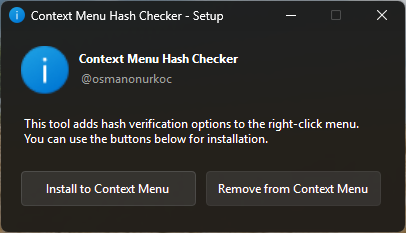
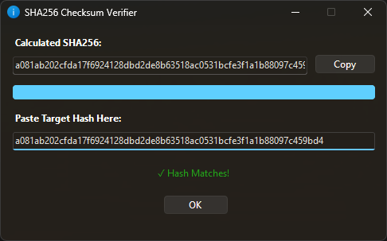
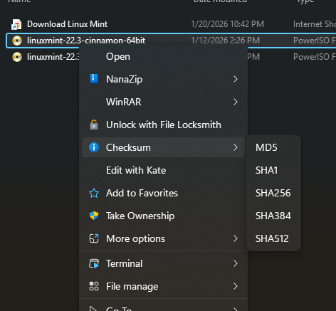

# Context Menu Hash Checker

A modern, lightweight, native Windows Forms utility that integrates directly into the Windows right-click context menu. This tool allows you to instantly calculate and verify file checksums (MD5, SHA1, SHA256, SHA384, SHA512) with a clean UI that automatically adapts to your system's Light or Dark theme.

---
### 📥 Download Latest

## 📸 Screenshots

  
  
    
  

---

## 🔥 Features

* **Instant Context Menu Integration:** Calculate hashes for any file directly from the Windows right-click menu.
* **All Major Algorithms:** Full support for MD5, SHA1, SHA256, SHA384, and SHA512 checksums.
* **Self-Installing & Portable:** Acts as its own setup launcher. Simply double-click the `.exe` to cleanly add or remove registry keys without needing a separate installer.
* **Dynamic Theme Support:** Automatically reads the Windows Registry to adapt its UI colors to your system's Light or Dark mode.
* **Large File Optimization:** Uses a 1MB buffer limit and `SequentialScan` to provide blazing-fast disk read speeds, even for massive video files or disk images.
* **Native & Lightweight:** Built entirely with vanilla Windows Forms (C#), ensuring zero bloat and instant startup times.

## 🚀 How to Run & Install

#### Option 1: Using the Executable (Recommended)
1. Download the latest `HashChecker.exe` from the **[Releases Page](https://github.com/osmanonurkoc/ContextMenuHashChecker/releases/latest)**.
2. Double-click the executable to open the Setup Launcher.
3. Click **"Install to Context Menu"**. 
4. Right-click any file in Windows Explorer, go to **Checksum**, and select your desired algorithm!

#### Option 2: Compiling from Source
1. Download or clone the source code.
2. Ensure you have the `.NET SDK` installed.
3. Run the included `compile.cmd` script to automatically clean artifacts and build a self-contained, single-file executable.

## 🛠️ Usage

1.  Right-click on any file you want to verify.
    
2.  Navigate to the **Checksum** menu.
    
3.  Click the algorithm you wish to calculate (e.g., SHA256).
    
4.  Paste your target hash into the lower text box. The program will instantly compare the values and notify you with a "Match" or "Mismatch" status.
    

## 📄 License

This project is licensed under the [MIT License](LICENSE).

----------

_Created by [@osmanonurkoc](https://www.osmanonurkoc.com)_
